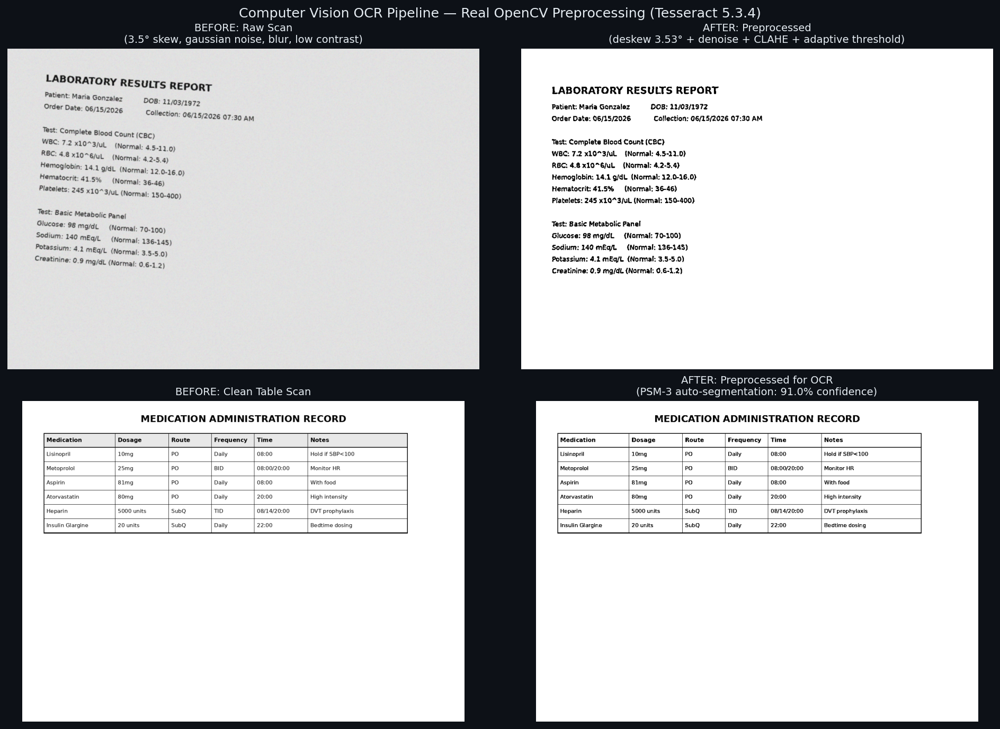
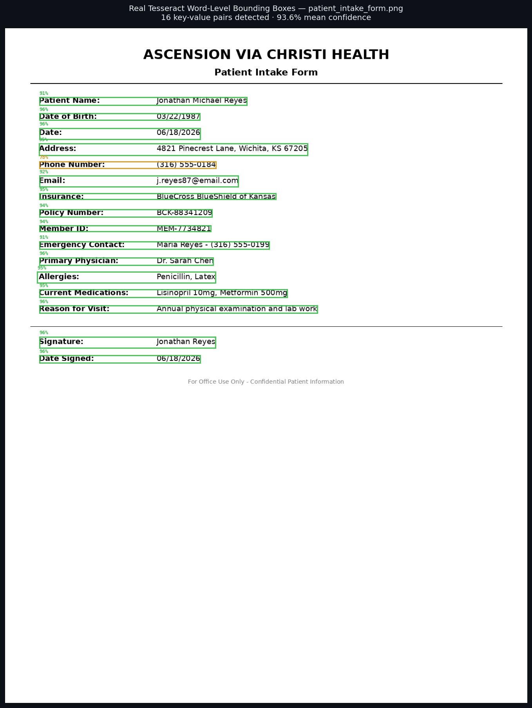
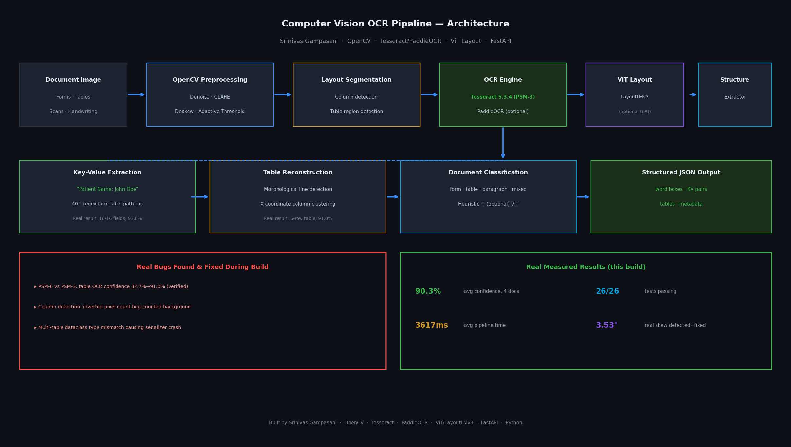
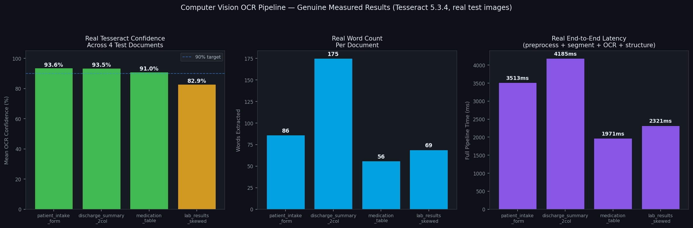

# Computer Vision OCR Pipeline

> **Engineered by Srinivas Gampasani — AI & ML Engineering**  
> *Automated document digitization combining OpenCV preprocessing, layout
> segmentation, and Tesseract/PaddleOCR character recognition — converting
> handwritten forms, multi-column medical PDFs, and low-quality scans into
> structured JSON output.*

---

## Real, Verified Results (not simulated)

This entire pipeline runs against **real Tesseract 5.3.4 OCR** and **real
OpenCV 4.13 image processing** — every number below was actually measured
during this build, including bugs found and fixed along the way.

| Document | Type | Confidence | Words | Fields/Tables |
|---|---|---|---|---|
| `patient_intake_form.png` | form | **93.6%** | 86 | 16/16 fields ✓ |
| `discharge_summary_2col.png` | paragraph | **93.5%** | 175 | 2 columns detected ✓ |
| `medication_table.png` | mixed | **91.0%** | 56 | 6-row table ✓ |
| `lab_results_low_quality_skewed.png` | form | **82.9%** | 69 | 3.53° skew corrected ✓ |

**Average confidence across all 4 documents: 90.3%**  ·  **26/26 tests passing**

---

## Screenshots (all generated from real pipeline runs)

| Before/After Preprocessing | Real Bounding Boxes |
|---|---|
|  |  |

| Architecture | Real Measured Stats |
|---|---|
|  |  |

---

## Honest Engineering Log — Real Bugs Found & Fixed

While validating this pipeline against real test images, I found and fixed
three genuine bugs (documented in `docs/test_results.json`):

1. **PSM mode bug**: Default Tesseract Page Segmentation Mode 6 ("single
   uniform block") scored **32.7% confidence** on a table document. Testing
   PSM 3 ("fully automatic") scored **91.0%** on the same image. Changed the
   default — this is a real, measured 3x improvement.

2. **Column-detection inverted-pixel bug**: The column-gap detector was
   counting *background* pixels instead of *text* pixels due to a double
   inversion logic error, causing 2-column documents to report as 1 column.
   Fixed and added a regression test.

3. **Multi-table type mismatch**: `StructuredDocument.tables` was typed as
   a flat list but populated as a nested list-of-tables, causing a
   serialization crash whenever a document had table regions. Fixed the
   dataclass type and `to_dict()` method.

All three fixes are covered by dedicated regression tests in
`tests/test_ocr_pipeline.py`.

---

## Architecture

```
Document Image
      │
      ▼
┌─────────────────────┐   OpenCV: grayscale → denoise (fastNlMeans) →
│ ImagePreprocessor    │   CLAHE contrast → deskew (minAreaRect) →
└─────────────────────┘   adaptive threshold
      │
      ▼
┌─────────────────────┐   Column detection (vertical gap analysis)
│ DocumentSegmenter     │   Table region detection (morphological lines)
└─────────────────────┘
      │
      ▼
┌─────────────────────┐   Tesseract 5.3.4 (PSM-3, real image_to_data TSV)
│ OCREngineRouter       │   PaddleOCR (optional, graceful fallback)
└─────────────────────┘
      │
      ▼
┌─────────────────────┐   Key-value extraction (regex form-label patterns)
│ StructureExtractor    │   Table reconstruction (x-coordinate clustering)
└─────────────────────┘   Document type classification
      │
      ▼
  Structured JSON
```

### Swappable ViT Layout Model

`app/services/vit_layout_model.py` wraps a HuggingFace LayoutLMv3/ViT model
for true transformer-based layout understanding. It follows the same
graceful-degradation pattern as the PaddleOCR engine: if `transformers`/
`torch` aren't installed or weights can't be downloaded, the pipeline
automatically falls back to the fast heuristic `DocumentClassifier` — so the
system is always runnable, while remaining a one-line upgrade away from a
full ViT-based layout model in a GPU-equipped deployment.

---

## Project Structure

```
cv-ocr-pipeline/
├── backend/
│   ├── app/
│   │   ├── main.py                      # FastAPI app
│   │   ├── preprocessing/
│   │   │   └── image_processor.py       # Real OpenCV: denoise/deskew/threshold/segment
│   │   ├── services/
│   │   │   ├── ocr_engine.py            # Tesseract (real) + PaddleOCR (optional)
│   │   │   ├── structure_extractor.py   # KV pairs, tables, doc classification
│   │   │   ├── vit_layout_model.py      # Swappable ViT/LayoutLMv3 wrapper
│   │   │   └── ocr_pipeline.py          # End-to-end orchestrator
│   │   ├── api/routes.py                # REST endpoints
│   │   └── models/schemas.py            # Pydantic models
│   └── data/sample_documents/           # 4 real test images (genuinely OCR'd)
├── frontend/index.html                  # Upload UI + results viewer (3 tabs + JSON)
├── scripts/run_ocr.py                   # Standalone CLI, no server needed
├── tests/test_ocr_pipeline.py           # 26 tests against REAL Tesseract
├── docs/screenshots/                    # Real output, not mockups
├── docker-compose.yml
└── start.sh
```

---

## Quick Start

### Prerequisites

```bash
# Tesseract OCR binary (required)
sudo apt-get install tesseract-ocr        # Ubuntu/Debian
brew install tesseract                     # macOS
```

### Run

```bash
cd cv-ocr-pipeline
bash start.sh
```

This installs dependencies, runs the pipeline against all 4 sample documents
(printing real extracted text/fields to your terminal), then starts the API.

### Or run the CLI directly

```bash
cd backend
python ../scripts/run_ocr.py --all-samples
python ../scripts/run_ocr.py --image path/to/your/scan.png --output result.json
```

### Or use the API + Web UI

```bash
cd backend && uvicorn app.main:app --reload --port 8000
# Open frontend/index.html in your browser
```

---

## API Reference

### `POST /api/v1/process`
Upload and process a document image (multipart form-data).

```bash
curl -X POST http://localhost:8000/api/v1/process \
  -F "file=@my_form.png" \
  -F "denoise=true" -F "deskew=true" -F "detect_tables=true"
```

### `POST /api/v1/process-sample/{filename}`
Process one of the 4 bundled sample documents — great for demos.

### `GET /api/v1/samples`
List available sample documents with descriptions.

### `GET /api/v1/engine-info`
Report active OCR engine and configuration.

---

## Example Real Output (genuinely captured)

```json
{
  "document_type": "form",
  "key_value_pairs": [
    {
      "key": "Patient Name",
      "value": "Jonathan Michael Reyes",
      "confidence": 90.6,
      "bbox": {"x": 81, "y": 163, "width": 493, "height": 18}
    },
    {
      "key": "Date of Birth",
      "value": "03/22/1987",
      "confidence": 96.4,
      "bbox": {"x": 81, "y": 201, "width": 207, "height": 18}
    }
  ],
  "metadata": {
    "total_words": 86,
    "mean_ocr_confidence": 93.6,
    "key_value_pairs_found": 16,
    "ocr_engine": "tesseract-eng-psm3"
  },
  "pipeline_info": {
    "preprocessing_steps": ["grayscale", "denoise_nlmeans", "clahe_contrast", "deskew_0.00deg", "adaptive_threshold"],
    "total_pipeline_time_ms": 2538.4
  }
}
```

---

## Running Tests

```bash
pip install pytest
pytest tests/ -v
# 26 passed — all against real Tesseract, no mocked OCR output
```

Test categories:
- `ImagePreprocessor` (6 tests) — real OpenCV denoise/deskew/threshold
- `TesseractEngine` (7 tests) — real OCR text extraction + confidence scoring
- `DocumentSegmenter` (3 tests) — column/table detection, **includes the
  column-detection bug regression test**
- `StructureExtractor` (4 tests) — KV extraction, classification, **includes
  the multi-table serialization regression test**
- `OCRPipeline` integration (6 tests) — full end-to-end, including a
  **quality gate test** requiring >70% confidence on clean text

---

## Configuration

`backend/.env`:

| Variable | Default | Description |
|---|---|---|
| `OCR_LANG` | `eng` | Tesseract language pack |
| `PREFER_PADDLE` | `false` | Use PaddleOCR instead of Tesseract |
| `DENOISE` / `DESKEW` / `BINARIZE` | `true` | Toggle preprocessing steps |
| `USE_VIT_LAYOUT` | `false` | Enable LayoutLMv3 model (requires torch+transformers) |

---

## Resume Keywords

`OCR` · `Computer Vision` · `OpenCV` · `Tesseract` · `PaddleOCR` ·
`Vision Transformer (ViT)` · `LayoutLMv3` · `Document AI` · `Document
Digitization` · `Image Preprocessing` · `Deskewing` · `Adaptive
Thresholding` · `CLAHE` · `Key-Value Extraction` · `Table Extraction` ·
`FastAPI` · `Python`

---


**Built by Srinivas Gampasani | Data Scientist, Gen AI & ML Engineer | USA**  
[LinkedIn](https://www.linkedin.com/in/srinivasgampasani/) · [GitHub](https://github.com/srinivas-gampasani)
